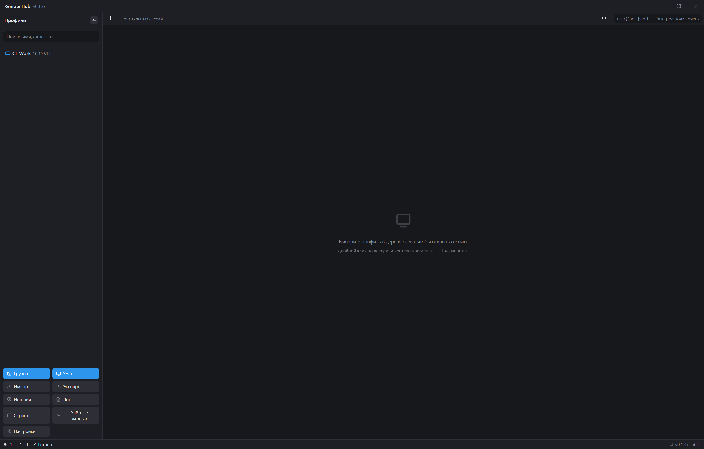
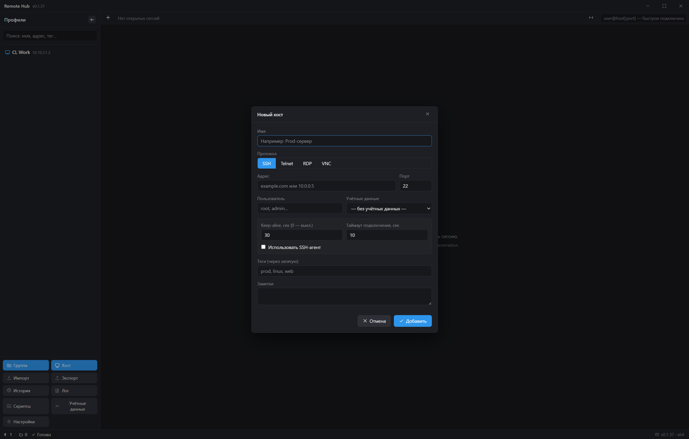
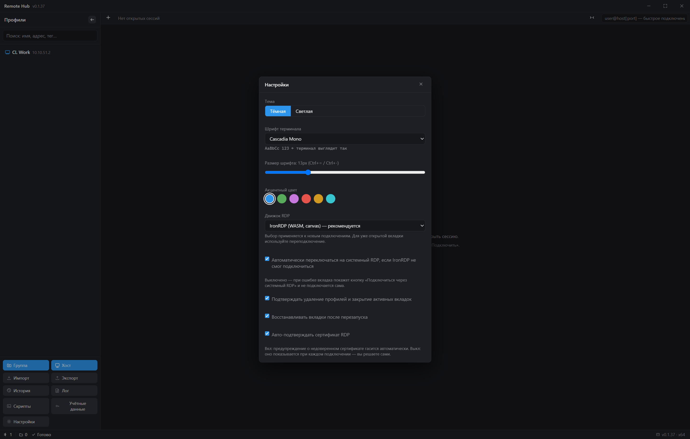

# Руководство пользователя Remote Hub

Remote Hub — программа для Windows, которая собирает в одном окне всё, что нужно для работы с удалёнными компьютерами и серверами: подключение по SSH и Telnet, удалённый рабочий стол (RDP), просмотр экрана (VNC), обмен файлами (SFTP) и безопасные туннели. Все серверы хранятся в виде удобного дерева профилей — как закладки в браузере, только для подключений.

Всё хранится локально на вашем компьютере: профили — в файле, пароли и ключи — в зашифрованном виде средствами Windows. Ничего не уходит в облако, аккаунт создавать не нужно.

---

## 1. Быстрый старт

1. Установите программу из файла `Remote Hub Setup 0.1.0.exe` (двойной клик, затем «Далее»).
2. Запустите Remote Hub.
3. Слева — дерево профилей, справа — область сессий (вкладок).

Программа работает на **Windows 10 и новее**. Файл установщика вам передаст тот, кто поставил программу (например, администратор), — если его нет под рукой, попросите ссылку или копию у него.

В первый раз дерево пустое. Чтобы завести первый сервер, нажмите **＋ Группа** (папка для организации) или **＋ Хост** (сам сервер) внизу панели — или щёлкните правой кнопкой мыши по пустому месту.

---

## 2. Дерево профилей

Дерево — это ваша рабочая карта. Оно состоит из:

- **Групп** — папок для организации (например, «Работа», «Домашние серверы», «Стенд»);
- **Хостов** — конкретных серверов: имя, адрес, порт, протокол, теги.

### Добавить хост

1. Нажмите **＋ Хост** внизу панели (или пункт «Добавить хост сюда…» в контекстном меню группы).
2. Заполните форму:

   - **Имя** — как сервер будет называться в дереве (например, «Файловый сервер»);
   - **Протокол** — SSH, Telnet, RDP или VNC;
   - **Адрес** — IP-адрес или имя (например, `10.0.0.11` или `server.example.com`);
   - **Порт** — программа подставит стандартный порт протокола (SSH — 22, RDP — 3389 и т.д.), но его можно изменить;
   - **Пользователь** — логин на сервере (например, `root` или `admin`);
   - **Учётные данные** — сохранённый набор «логин + пароль», если он уже есть (см. раздел 6); можно оставить пустым;
   - **Теги** (через запятую) — метки для быстрого поиска, например `важно, прод`.

   Нажмите **Добавить**.

   

3. Профиль появится в дереве. Чтобы **подключиться** — двойной клик по хосту (или правая кнопка → «Подключить»).

### Изменить или удалить

- **Правая кнопка мыши по хосту** → меню: «Подключить», «SFTP» (только для SSH-хостов), «Проверить доступность», «Изменить…», «Дублировать», «Удалить».
- Удаление спрашивает подтверждение (если включено в настройках — см. раздел 7).

### Поиск и теги

Вверху панели есть поле поиска: вводите часть имени, адреса или тега — дерево само отфильтруется. Рядом — фильтр тегов («Все теги»).

### Проверка доступности

Пункт **«Проверить доступность»** в контекстном меню хоста проверяет, жив ли сервер: открывает TCP-порт протокола и отправляет ping. Результат появляется рядом с хостом в дереве: зелёный «отвечает · 42 мс» или красный «недоступен».

### Импорт и экспорт

Кнопки **Импорт** и **Экспорт** внизу панели переносят дерево профилей в файл и обратно — удобно при переезде на другую машину или для резервной копии. Важно: **пароли и ключи в экспортируемый файл не попадают** (это сделано намеренно, ради безопасности) — на новом компьютере их нужно будет ввести заново.

---

## 3. Подключение: SSH, Telnet, RDP, VNC

Двойной клик по хосту открывает **вкладку сессии** сверху. Вкладок может быть сколько угодно — они переключаются кликом, закрываются по крестику или `Ctrl+W`.

### Какой протокол выбрать

| Протокол | Когда нужен |
|---|---|
| **SSH** | Управление сервером командами (Linux-серверы, сетевое оборудование). Трафик **шифруется** — выбирайте его, когда есть выбор |
| **Telnet** | То же, что SSH, но для старых устройств, которые не умеют SSH (старое сетевое оборудование). **Не шифрует** трафик — не используйте на открытых или чужих сетях |
| **RDP** | Полный удалённый рабочий стол **Windows** — вы видите экран и работаете мышью, как за тем компьютером |
| **VNC** | Экран удалённого компьютера **любой** системы, когда RDP недоступен (Linux, macOS, старые Windows) |

Если не знаете, что выбрать, — спросите администратора сервера: обычно он подскажет и протокол, и адрес, и порт.

### SSH и Telnet — терминал

Открывается окно терминала: можно вводить команды как в обычной консоли. У SSH-сессии, помимо команд, есть **SFTP** (см. раздел 4) и **туннели** (раздел 5) — кнопки на панели вкладки.

При первом подключении к незнакомому серверу программа спросит, доверяете ли вы его «отпечатку» (ключу) — это нормальная защита от подмены сервера, подтвердите.

### RDP — удалённый рабочий стол

Откроется **отдельное окно Windows** «Подключение к удалённому рабочему столу» (встроенный клиент Windows). Логин и пароль программа подставит сама, если они сохранены в учётных данных хоста. Закрытие окна завершает сессию.

### VNC — просмотр экрана

Откроется встроенный просмотрщик экрана удалённого компьютера — как будто вы сидите за ним.

### Быстрое подключение

Не хочется заводить профиль? В поле под строкой вкладок введите `пользователь@адрес` или `пользователь@адрес:порт` (подсказка в самом поле — `user@host[:port] — быстрое подключение`) и нажмите `Enter` — сессия откроется без сохранения в дереве. Такую сессию потом можно сохранить в дерево кнопкой **💾** («Сохранить как профиль»).

### Если сервер просит пароль

Когда пароль не сохранён, программа покажет диалог ввода пароля прямо при подключении — впишите его и нажмите «Подключить». Если пароль неверный, диалог появится снова. Такой пароль можно и сохранить, поставив галочку — он попадёт в зашифрованное хранилище.

---

## 4. SFTP — обмен файлами

SFTP работает через SSH-подключение и не требует отдельного сервера.

1. Найдите в дереве хост с протоколом **SSH**.
2. Щёлкните по нему **правой кнопкой** и выберите пункт **SFTP**.

Откроется двухпанельный браузер: **слева — «Локально» (ваш компьютер), справа — «Сервер» (удалённый компьютер)**.

- **Скачать файл с сервера** — кнопка **«Скачать»** рядом с файлом в правой панели (или двойной клик по файлу). Идёт полоса прогресса.
- **Загрузить файл на сервер** — выделите файл в левой панели и нажмите **«↑ Загрузить»** в шапке правой панели.
- Создать папку — кнопка **«＋ Папка»**; обновить список — кнопка **⟳**.
- Если передача прервалась, программа пометит неполный файл: «файл неполный (N из M)» — вы сразу увидите, что копию нельзя считать готовой.

---

## 5. Туннели

Туннель — способ достучаться до сервиса, который спрятан за сервером и напрямую недоступен. Например, база данных на внутреннем адресе.

1. Откройте SSH-сессию до сервера, у которого есть доступ к нужному сервису.
2. На панели вкладок нажмите значок **⧉** (подсказка «Туннели (порт-форвардинг)»).
3. Укажите:

   - **Лок. порт** — порт на вашем компьютере (например, `5432`);
   - **Целевой хост** — внутренний адрес сервиса (обычно `localhost`);
   - **Цел. порт** — порт сервиса (например, `5432` для PostgreSQL).

4. Нажмите «Добавить» — и теперь программа на вашем компьютере (например, `127.0.0.1:5432`) прозрачно ведёт к сервису через SSH-соединение.

Работать с таким туннелем можно любой вашей программой — клиентом базы данных, браузером и т.д. Если локальный порт уже занят другой программой, появится сообщение «порт занят» — возьмите другой номер.

---

## 6. Учётные данные

Кнопка **🔑 Учётные данные** внизу панели открывает хранилище наборов «логин + пароль». Один набор можно привязать к нескольким хостам — не придётся вводить пароль для каждого.

Набор может содержать:

- **Пользователь** — логин;
- **Пароль** — хранится зашифрованным;
- **SSH-ключ** — путь к файлу ключа (вместо пароля) и **парольная фраза** к нему, если ключ защищён;
- галочка **«Использовать SSH-агент (Windows OpenSSH)»** — подключение через системный SSH-агент Windows (без хранения секретов в программе).

Как программа выбирает способ входа (по приоритету):

1. сохранённый **пароль** (или набор учётных данных);
2. **SSH-ключ** с парольной фразой;
3. **агент Windows**;
4. **диалог пароля** — спросит прямо при подключении.

---

## 7. Настройки

Кнопка **⚙ Настройки** внизу панели. Что можно настроить:

- **Тема** — тёмная или светлая;
- **Шрифт терминала** — все моноширинные шрифты, установленные в системе (список собирается автоматически); применяется сразу, образец начертания — под списком;
- **Размер шрифта** — ползунок, быстрее менять в сессии: `Ctrl+=` / `Ctrl+-`;
- **Акцентный цвет** — цветовое пятно интерфейса (подсветка активных элементов);
- **Подтверждать удаление** профилей и закрытие активных вкладок — защита от случайных действий;
- **Восстанавливать вкладки после перезапуска** — после закрытия программы все открытые сессии вернутся на место.

Настройки применяются мгновенно и сохраняются сами.

---

## 8. Обновление программы

**Как узнать версию.** Номер версии показан внизу окна, в строке состояния справа: `Remote Hub v0.1.0 · …`. Если вы получали программу от администратора — при обращении за помощью просто скажите эту строку целиком.

**Как обновить.** Автоматического обновления пока нет: новая версия ставится поверх старой — скачайте свежий установщик (см. раздел 1) и запустите его, не удаляя программу. Профили, настройки и пароли хранятся отдельно от файлов программы и при таком обновлении сохраняются; на всякий случай перед обновлением сделайте **Экспорт** дерева (раздел 2).

**Что менялось между версиями.** Сейчас выпущена одна версия — **v0.1.0** (август 2026, первый релиз). В неё вошли:

- каркас приложения: главное окно, дерево профилей, вкладки сессий;
- терминалы SSH и Telnet (пароль, ключ, агент Windows, диалог пароля);
- удалённый рабочий стол RDP и просмотр экрана VNC;
- обмен файлами SFTP с прогрессом и туннели (порт-форвардинг);
- учётные данные с шифрованием, сниппеты быстрых команд, тёмная/светлая тема и акцентный цвет;
- исправление: крэш терминала при переключении вкладок;
- установщик Windows, автотесты и смоук-сценарии интерфейса.

Полная история обновлений (с пометками «новое» и «исправлено») — в changelog на странице проекта: [страница проекта](../landing/index.html), раздел «Как это работает».

---

## 9. Горячие клавиши

| Клавиши | Действие |
|---|---|
| `Ctrl+Shift+T` | Новая сессия |
| `Ctrl+W` | Закрыть вкладку |
| `Ctrl+Tab` | Следующая вкладка |
| `Ctrl+1…9` | Переключиться на вкладку |
| `Ctrl+F` | Поиск в выводе терминала |
| `Ctrl+=` / `Ctrl+-` | Увеличить / уменьшить шрифт |
| `Ctrl+Shift+C` / `Ctrl+Shift+V` | Копировать / вставить в терминал |
| `Enter` | Быстрое подключение / поиск |

Полный список — пункт «Горячие клавиши» в меню.

---

## 10. Приватность и хранение

- Профили и настройки лежат в папке данных программы на вашем диске.
- Пароли, ключи и парольные фразы шифруются **средствами Windows** — расшифровать их может только ваш пользователь Windows на этой машине.
- Программа не подключается ни к каким облачным сервисам и не передаёт данные наружу — всё соединение идёт напрямую к вашим серверам.

---

## 11. Частые вопросы

**Сервер не подключается, что делать?**
Сначала «Проверить доступность» (правая кнопка по хосту): если «недоступен» — проверьте адрес, порт, включён ли сервер и разрешён ли нужный порт в его брандмауэре. Если порт отвечает, а вход не проходит — проверьте логин/пароль (раздел 6).

**«Порт занят» при добавлении туннеля**
Другой программе уже принадлежит этот порт. Возьмите другой локальный порт (например, `5433`).

**RDP-сессия открывает окно, но пароль не подставляется**
Windows Remote Desktop иногда не принимает пароль, в котором есть специальные символы, переданный программно. Введите пароль вручную в окне Windows или упростите пароль сервера.

**Пропал сервер из дерева**
Воспользуйтесь резервной копией: кнопка **Импорт** восстанавливает дерево из ранее экспортированного файла.

**Где взять отпечаток сервера при первом подключении?**
Администратор сервера скажет «fingerprint» — сверьте с тем, что показывает программа, и подтвердите.

**Соединение оборвалось посреди работы?**
Нажмите **«Переподключить»** в панели сессии — или закройте вкладку (крестик или `Ctrl+W`) и откройте заново двойным кликом по хосту. Незавершённую передачу файлов программа пометит как неполную (см. раздел 4), и вы не примете её за готовую копию.

---

*Remote Hub 0.1.0 · Руководство для пользователей · Все скриншоты — реальные снимки интерфейса приложения.*
